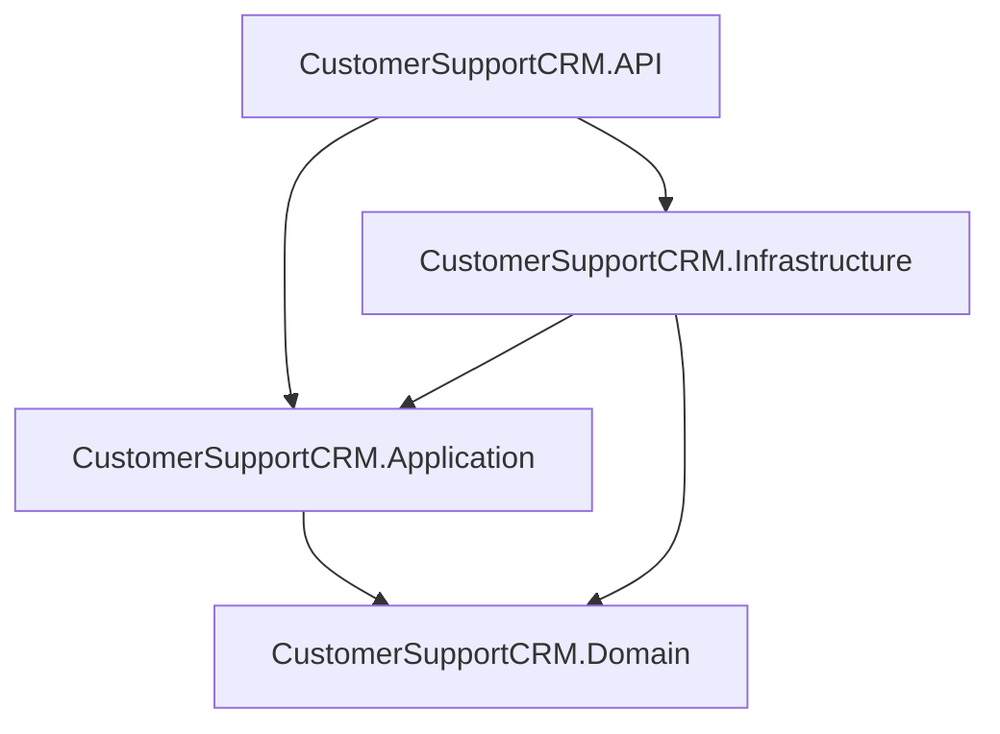

# CustomerSupportCRM — Backend Architecture

This document describes the architecture of `src/BackEnd` — an ASP.NET Core Web
API built on Onion Architecture for a Customer Support CRM. **This change
contains architecture and infrastructure only.** No CRM business entities,
features, or endpoints (Customer, Ticket, Agent, ...) are implemented yet.

## 1. Architecture overview

Four projects, one solution (`CustomerSupportCRM.sln`), dependencies pointing
strictly inward:

```
src/
    CustomerSupportCRM.Domain/          # innermost — no dependencies
    CustomerSupportCRM.Application/     # depends on Domain
    CustomerSupportCRM.Infrastructure/  # depends on Application, Domain
    CustomerSupportCRM.API/             # depends on Application, Infrastructure — composition root
```



## 2. Onion Architecture

Dependencies only ever point toward `Domain`. `Domain` depends on nothing.
`Application` depends only on `Domain`. `Infrastructure` depends on `Application`
and `Domain` (never on `API`). `API` is the **composition root**: the one place
allowed to reference every other layer, because it is where DI wiring, hosting,
and the HTTP pipeline live.

**Enforced rules (verified — see §15):**

| Layer | May depend on | Must NOT depend on |
|---|---|---|
| Domain | nothing | Application, Infrastructure, API, EF Core, ASP.NET Core, Identity |
| Application | Domain | Infrastructure, API |
| Infrastructure | Domain, Application | API |
| API | Application, Infrastructure | — (composition root) |

## 3. Project responsibilities

### Domain (`CustomerSupportCRM.Domain`)
Pure C#, zero NuGet package references (verified: its `.csproj` has no
`PackageReference` at all — see §15).

- `Common/BaseEntity.cs` — `Id` (`Guid`), `CreatedAt`, `UpdatedAt`, `CreatedBy`,
  `UpdatedBy`, `IsDeleted`. Every future entity derives from this.
- `Interfaces/IGenericRepository<T>.cs`, `Interfaces/IUnitOfWork.cs` — persistence
  abstractions (see §4–5).
- `Exceptions/` — `DomainException` (abstract base), `NotFoundException`,
  `ConflictException`, `ForbiddenAccessException`, `UnauthorizedException`.
  `UnauthorizedException` is intentionally distinct from
  `System.UnauthorizedAccessException` so the API's exception handler maps it
  deliberately.
- `Constants/Roles.cs` — `Admin`, `Supervisor`, `Manager`, `Agent` as plain
  strings, shared by Infrastructure (role seeding) and API (`[Authorize(Roles = ...)]`)
  without either depending on ASP.NET Core Identity.
- `Entities/`, `ValueObjects/`, `Enums/` — empty placeholders (README only) for
  future CRM concepts.

### Application (`CustomerSupportCRM.Application`)
References only Domain. Packages: FluentValidation,
FluentValidation.DependencyInjectionExtensions, AutoMapper.

- `DependencyInjection.cs` — `AddApplication()`: registers AutoMapper and
  FluentValidation validators by scanning this assembly (new features add a
  `Profile`/`AbstractValidator<T>` class; no DI wiring needed).
- `Common/Interfaces/ICurrentUserService.cs` — "who is making this request"
  abstraction (see §9).
- `Common/Models/Result.cs`, `Result<T>` — outcome type for use cases that fail
  for expected business reasons, without throwing (not implemented against
  anything yet — no use cases exist).
- `Common/Models/JwtSettings.cs`, `ApplicationSettings.cs`, `LocalizationSettings.cs` —
  strongly typed bindings of the `Jwt`, `ApplicationSettings`, and `Localization`
  configuration sections respectively (registered via the `IOptions<T>` pattern
  in `Program.cs`/`LocalizationExtensions`, except `JwtSettings`, which is
  validated once and registered as a singleton instance — see §8).
- `Common/Exceptions/ValidationException.cs` — wraps FluentValidation failures;
  lives here (not Domain) because it depends on `FluentValidation.Results.ValidationFailure`.
- `Common/Behaviors/`, `DTOs/`, `Validators/`, `Mappings/`, `Services/`,
  `Features/{Customers,Tickets,Users,Agents}/` — empty placeholders (README
  only) for feature-based organization (see §14).

### Infrastructure (`CustomerSupportCRM.Infrastructure`)
References Domain and Application. Packages: EF Core, EF Core SqlServer, EF Core
Design, ASP.NET Core Identity EntityFrameworkCore, plus a `FrameworkReference` to
`Microsoft.AspNetCore.App` (see §8 for why).

- `Persistence/Context/ApplicationDbContext.cs` — `IdentityDbContext<ApplicationUser, ApplicationRole, Guid>`.
- `Persistence/Configurations/` — `IEntityTypeConfiguration<T>` classes (never
  attributes/config on the entity itself).
- `Persistence/Interceptors/AuditableEntitySaveChangesInterceptor.cs` — audit +
  soft delete enforcement (see §10–11).
- `Persistence/Repositories/GenericRepository.cs`, `Persistence/UnitOfWork/UnitOfWork.cs`
  — implementations of the Domain interfaces (see §4–5).
- `Identity/ApplicationUser.cs`, `Identity/ApplicationRole.cs`,
  `Identity/IdentityExtensions.cs`, `Identity/RoleSeeder.cs` — see §7.
- `DependencyInjection.cs` — `AddInfrastructure(configuration)`.

### API (`CustomerSupportCRM.API`)
References Application and Infrastructure (composition root only — no business
logic here).

- `Program.cs` — thin composition root; each concern is one extension method
  call (see §6).
- `Extensions/` — `SwaggerServiceExtensions`, `JwtAuthenticationExtensions`,
  `CorsServiceExtensions`, `HealthCheckServiceExtensions`, `ControllerServiceExtensions`
  (MVC controllers + the JSON Unicode-encoder fix — see §13a).
- `Middlewares/GlobalExceptionHandler.cs` — `IExceptionHandler` (see §12).
- `Filters/ValidationFilter.cs` — FluentValidation ↔ MVC integration (see §13).
- `Localization/LocalizationExtensions.cs`, `Resources/SharedResource*.resx` —
  see §14.
- `Services/CurrentUserService.cs` — `ICurrentUserService` implementation
  (see §9).
- `Controllers/BaseApiController.cs` — common `[ApiController]` base; no CRM
  controllers derive from it yet.
- `Models/` — empty placeholder for API-boundary shapes that intentionally
  differ from Application DTOs (rare).

## 4. Generic Repository

`Domain.Interfaces.IGenericRepository<T>` (`T : BaseEntity`) — `GetByIdAsync`,
`GetAllAsync`, `FindAsync`, `Query()` (composable read-only `IQueryable<T>` for
paging/projection), `AddAsync`, `AddRangeAsync`, `Update`, `Delete`,
`ExistsAsync`, `CountAsync`. All async, all accept `CancellationToken`.

Implemented by `Infrastructure.Persistence.Repositories.GenericRepository<T>`
using EF Core. Reads use `AsNoTracking()`. `Delete()` performs a **soft** delete
(`IsDeleted = true` + `Update`), never `DbSet.Remove()`.

The repository contract lives in Domain (not Application) so both Application
and Infrastructure depend on the same abstraction without Application needing
to know it's backed by EF Core.

## 5. Unit of Work

`Domain.Interfaces.IUnitOfWork` — `Repository<T>()` (returns a cached
`IGenericRepository<T>` per aggregate type) and `SaveChangesAsync(CancellationToken)`.
Deliberately has **no** `Customers`/`Tickets`/... properties, so it never needs
to change as CRM features are added.

Implemented by `Infrastructure.Persistence.UnitOfWork.UnitOfWork`, registered
scoped — one unit of work (and its cached repositories) per HTTP request.

## 6. Dependency Injection

`Program.cs` stays a short, readable list:

```csharp
builder.Services.AddApplication();
builder.Services.AddInfrastructure(builder.Configuration);

builder.Services.AddHttpContextAccessor();
builder.Services.AddScoped<ICurrentUserService, CurrentUserService>();
// ... exception handling, controllers + ValidationFilter, localization,
// JWT auth, CORS, Swagger, health checks — each one extension method.
```

`ICurrentUserService` is registered in **API**, not Infrastructure, even though
it's consumed by Infrastructure's audit interceptor — see §9 for why.

## 7. ASP.NET Core Identity

`Infrastructure/Identity/ApplicationUser.cs` (`IdentityUser<Guid>`) and
`ApplicationRole.cs` (`IdentityRole<Guid>`) are intentionally **empty**: they
represent "who can log in", not a CRM business concept. No `CustomerId`,
`AgentId`, or similar properties were added, and no login/register/refresh-token
endpoints exist yet.

`IdentityExtensions.AddIdentityInfrastructure()` wires
`AddIdentity<ApplicationUser, ApplicationRole>().AddEntityFrameworkStores<ApplicationDbContext>().AddDefaultTokenProviders()`
with a baseline password/lockout policy. Identity tables live in the same
`ApplicationDbContext`/SQL Server database as future CRM tables (`IdentityDbContext<ApplicationUser, ApplicationRole, Guid>`)
— no separate Identity database, per the requirement to avoid unnecessary
infrastructure duplication. `Persistence/Configurations/ApplicationUserConfiguration.cs`
and `ApplicationRoleConfiguration.cs` rename the primary tables to `Users`/`Roles`
via `IEntityTypeConfiguration<T>`.

**Note on `Infrastructure`'s `FrameworkReference`:** `AddIdentity<TUser, TRole>()`
lives in `Microsoft.AspNetCore.Identity.dll`, part of the ASP.NET Core shared
framework rather than a standalone NuGet package. `Infrastructure.csproj` adds
`<FrameworkReference Include="Microsoft.AspNetCore.App" />` to access it without
becoming a Web SDK project itself (no hosting model, no Kestrel — it still
produces a plain library).

Future business entities (`Agent`, `Customer`, ...) must reference
`ApplicationUser.Id` by value, never inherit from `ApplicationUser`/`IdentityUser`.

### Future Identity operations
No `IIdentityService`, login, registration, or token issuance exists yet — per
"no unnecessary abstractions", that interface is added in Application (and
implemented in `Infrastructure/Identity/Services/`, currently an empty
placeholder) only once the first real auth use case is built.

### Role seeding
`Infrastructure/Identity/RoleSeeder.cs` ensures the roles in
`Domain.Constants.Roles` (Admin, Supervisor, Manager, Agent) exist, called once
at API startup (`Program.cs`, after `app.MapControllers()`, before `app.Run()`).
**Roles only — no users, no passwords, no credentials.** It is wrapped in a
`try`/`catch` that logs a warning rather than crashing the host: seeding runs
before any deployment is guaranteed to have applied migrations yet (first
deploy, or a fresh dev machine with no local SQL Server), and a missing
database must degrade the same way the `/health` check already does, not take
the whole application down.

## 8. JWT authentication

`Application.Common.Models.JwtSettings` binds the `Jwt` configuration section
(`Issuer`, `Audience`, `SecretKey`, `ExpirationMinutes`). It lives in
Application (not Infrastructure or API) so a future token-issuing service in
Infrastructure and the authentication middleware in API can both depend on it
without depending on each other.

`API/Extensions/JwtAuthenticationExtensions.AddJwtAuthentication()` configures
`AddAuthentication().AddJwtBearer()` with standard validation parameters
(issuer, audience, signing key, lifetime) and `AddAuthorization()`. **No
login/register endpoints or token-issuing code exist yet** — only the
validation/challenge pipeline, ready for the first auth feature to plug into.
Role-based authorization will use `[Authorize(Roles = Domain.Constants.Roles.Admin)]`
etc. directly; no CRM-specific policies were added.

`Jwt:SecretKey` and `ConnectionStrings:DefaultConnection` are **empty** in
`appsettings.json` and `appsettings.Production.json` — real values must come
from environment variables / a secret store at deploy time, never committed.
`appsettings.Development.json` has a clearly-labeled placeholder dev secret and
a LocalDB connection string so local `dotnet run` works out of the box.

## 9. Current user abstraction

`Application.Common.Interfaces.ICurrentUserService` exposes only plain data —
`UserId` (`Guid?`), `UserName`, `IsAuthenticated`, `Roles`, `IsInRole(role)` —
never `HttpContext`, `ClaimsPrincipal`, `UserManager`, or `ApplicationUser`.
Consumers (Infrastructure's audit interceptor, future Application use cases)
depend only on this interface.

Implemented by `API/Services/CurrentUserService.cs` using `IHttpContextAccessor`
— placed in **API**, not Infrastructure, because `IHttpContextAccessor` is only
available for free (no extra package) in a Web SDK project; Infrastructure
consumes the interface without knowing the implementation's location. It never
throws for unauthenticated or background-triggered requests — it just returns
`null`/`false`/an empty role list.

## 10. Auditing

`AuditableEntitySaveChangesInterceptor` (an EF Core `SaveChangesInterceptor`,
registered scoped and attached via `DbContextOptionsBuilder.AddInterceptors` in
`Infrastructure.DependencyInjection.AddInfrastructure`) stamps
`CreatedAt`/`CreatedBy` on `Added` entries and `UpdatedAt`/`UpdatedBy` on
`Modified` entries, using `ICurrentUserService.UserId` — `null` for
unauthenticated/background saves rather than throwing. All timestamps are UTC
(`DateTime.UtcNow`), never server-local time.

## 11. Soft delete

`BaseEntity.IsDeleted` plus an EF Core **global query filter** applied
reflectively in `ApplicationDbContext.OnModelCreating` to every entity type
deriving from `BaseEntity` — so it's automatic for all future entities, no
per-entity opt-in code. Normal queries exclude soft-deleted rows automatically.

Two layers of enforcement against accidental physical deletes:
1. `GenericRepository<T>.Delete()` sets `IsDeleted = true` and calls `Update`,
   never `DbSet.Remove()`.
2. `AuditableEntitySaveChangesInterceptor` converts any tracked entry that is
   still `EntityState.Deleted` at save time (e.g. from a direct `DbSet.Remove()`
   call bypassing the repository) into `Modified` with `IsDeleted = true`.

Administrative access to soft-deleted records (e.g. `IgnoreQueryFilters()`) is
not implemented yet — deferred to whichever future feature needs it.

## 12. Global exception handling

`API/Middlewares/GlobalExceptionHandler.cs` implements the ASP.NET Core 8+
`IExceptionHandler` extensibility point (`AddExceptionHandler<T>()` +
`AddProblemDetails()` + `app.UseExceptionHandler()`), rather than a hand-rolled
try/catch middleware — the standard mechanism today.

| Exception | HTTP status |
|---|---|
| `Application.Common.Exceptions.ValidationException` | 400, `ValidationProblemDetails` with per-property errors |
| `Domain.Exceptions.NotFoundException` | 404 |
| `Domain.Exceptions.UnauthorizedException` | 401 |
| `Domain.Exceptions.ForbiddenAccessException` | 403 |
| `Domain.Exceptions.ConflictException` | 409 |
| anything else | 500, generic localized message only — **no stack trace, connection string, or JWT secret is ever included** |

Every response is an RFC 7807 `ProblemDetails` (`status`, `title`, `detail`,
`instance`, plus a `traceId` extension from `HttpContext.TraceIdentifier`).
Unhandled/500 exceptions are logged server-side via `ILogger<GlobalExceptionHandler>`
with full detail; only the generic localized message reaches the client.

## 13. Validation (FluentValidation)

`FluentValidation.AspNetCore` is deprecated (automatic per-request-argument MVC
validation was removed from ASP.NET Core years ago and that package was never
updated for it), so this architecture wires validation explicitly:
`API/Filters/ValidationFilter.cs` is a global `IAsyncActionFilter` that, for
every action argument with a matching `IValidator<T>` registered in DI, runs it
before the action executes and throws `Application.Common.Exceptions.ValidationException`
on failure — caught by `GlobalExceptionHandler` and turned into a 400
`ValidationProblemDetails`.

Validators are auto-registered by `Application.DependencyInjection.AddApplication()`
(`AddValidatorsFromAssembly`) — no manual DI wiring per validator. **No
feature validators exist yet.** Validation messages must be resolved through
`IStringLocalizer<SharedResource>` rather than hard-coded English/Arabic
strings, once real validators are written.

## 13a. JSON serialization & culture

`API/Extensions/ControllerServiceExtensions.cs` (`AddApiControllers()`) sets a
custom `JsonSerializerOptions.Encoder` (`JavaScriptEncoder.Create(UnicodeRanges.All)`).
**Why this matters:** `System.Text.Json`'s default encoder escapes every
character outside Basic Latin as `\uXXXX` — without this, an Arabic response
like `"مرحباً"` would serialize as `"مرح..."`. Still valid JSON,
but it defeats the purpose of an Arabic-localized API and is harder to inspect.
Verified directly: the default encoder produces `مرحب...`
for `"مرحباً بك"`; the configured encoder produces the literal characters.

All persisted timestamps (`BaseEntity.CreatedAt`/`UpdatedAt`, stamped by
`AuditableEntitySaveChangesInterceptor` via `DateTime.UtcNow`) have
`DateTimeKind.Utc`, so `System.Text.Json`'s built-in `DateTime` converter
already serializes them as ISO-8601 with a `Z` suffix with no extra
configuration — no culture-dependent formatting is introduced anywhere.

## 14. Localization

Two cultures: `en` (default) and `ar`, selected via the standard
`Accept-Language` request header (no query-string/cookie provider — this is a
pure REST API). **Configuration-driven**, not hardcoded: `Application.Common.Models.LocalizationSettings`
binds the `Localization` section (`DefaultCulture`, `SupportedCultures`) via the
`IOptions<T>` pattern; `API/Localization/LocalizationExtensions.cs`
(`AddApiLocalization(configuration)` / `UseApiLocalization()`) reads that bound
options value to set `DefaultRequestCulture`, `SupportedCultures`, and
`SupportedUICultures` — so an environment can add a culture or change the
default purely through `appsettings.json`, no code change.

`API/Resources/SharedResource.cs` is an empty marker class used as
`IStringLocalizer<SharedResource>`'s generic argument, resolving
`SharedResource.resx` (en) and `SharedResource.ar.resx` (ar). Both currently
hold only generic system/error message keys (`UnexpectedError`,
`ValidationFailed`, `ResourceNotFound`, `UnauthorizedAccess`, `ForbiddenAccess`,
`Conflict`, `ApiWelcomeMessage`) — used by `GlobalExceptionHandler`. Feature
resource files are added the same way once features exist. JSON responses use
UTF-8 (ASP.NET Core's default) so Arabic text serializes correctly without
extra configuration; all timestamps are UTC on the wire regardless of culture.

### Localization contract for feature stories

Every feature story that produces a user-visible backend message must follow
this contract (locked in by `platform/multilingual-support-arabic-and-english`):

- New user-visible strings **must** flow through `IStringLocalizer<SharedResource>`
  (or a feature-specific `IStringLocalizer<TResource>` following the same
  empty-marker-class pattern as `Resources/SharedResource.cs`).
- New keys **must** be added to both `Resources/SharedResource.resx` (en) and
  `Resources/SharedResource.ar.resx` (ar) in the same commit. Missing-translation
  policy: `IStringLocalizer` falls back to the resource key name when a key is
  absent in a culture — treat any resource-parity gap as a bug, not an
  acceptable degradation.
- New keys **must** be exposed as `nameof`-style constants (mirror
  `SharedResourceKeys` in `Middlewares/GlobalExceptionHandler.cs`) so keys are
  never hand-typed at call sites and a rename is a compile error, not a
  runtime miss.
- No feature may register a cookie- or query-string culture provider;
  `Accept-Language` (via `AcceptLanguageHeaderRequestCultureProvider`) is the
  only supported provider — see `LocalizationExtensions.cs`.
- The default culture is `en`, driven by `appsettings.json`'s
  `Localization.DefaultCulture`. Environments override it via configuration,
  never by changing code.

## 15. Persistence

Single `ApplicationDbContext : IdentityDbContext<ApplicationUser, ApplicationRole, Guid>`
for Identity and future CRM tables alike, SQL Server via
`Microsoft.EntityFrameworkCore.SqlServer`. `ApplyConfigurationsFromAssembly` picks
up every `IEntityTypeConfiguration<T>` in Infrastructure automatically.
`ApplicationDbContextFactory` (`IDesignTimeDbContextFactory<ApplicationDbContext>`)
lets `dotnet ef` tooling create the context without running the full API host.

A migration, `InitialIdentitySchema`, was generated (see §16) purely to verify
the DbContext + Identity + Fluent API configuration produce a valid SQL Server
schema — it was not applied to any database, and no CRM tables are in it.

## 16. API response strategy

**Decision: no generic `ApiResponse<T>` wrapper.** Successful responses return
plain data (the DTO, or `204 No Content`) using normal HTTP status codes and
semantics; only errors are wrapped, as RFC 7807 `ProblemDetails` (§12). A
`{ success, data, message, errors }` envelope around every response — including
successes — was considered and rejected: it duplicates information the HTTP
status code already carries, complicates client-side typing for no benefit, and
is exactly the kind of unnecessary abstraction this architecture avoids.
`Application.Common.Models.Result`/`Result<T>` exists for use cases whose
failure is an expected business outcome (not an exception) — it is an
Application-internal type, not an HTTP envelope; a controller maps a failed
`Result` to the appropriate HTTP status itself.

## 17. Swagger / OpenAPI

`API/Extensions/SwaggerServiceExtensions.cs` — `Swashbuckle.AspNetCore`, with a
JWT Bearer security definition/requirement (Authorize button in the UI) and XML
doc comments (`GenerateDocumentationFile` in `CustomerSupportCRM.API.csproj`,
`NoWarn 1591` since not every member needs a doc comment). Swagger UI is only
mapped in `Development` (see `Program.cs`). No CRM endpoints exist to document
yet — only the composition root's own middleware/health surface.

## 18. Testing strategy

**No test projects were created in this change**, per explicit scope. When
introduced later, `tests/CustomerSupportCRM.UnitTests` and
`tests/CustomerSupportCRM.IntegrationTests` (xUnit, FluentAssertions, Moq) would
sit alongside `src/`, referencing the projects under test, without the
production projects ever referencing them back.

## 19. Future feature organization

New CRM features follow the placeholders already scaffolded:

```
Application/Features/<Feature>/
    Commands/       (state-changing use cases)
    Queries/         (read use cases)
    DTOs/
    Validators/
    Mappings/
```

A feature adds an entity under `Domain/Entities/` (deriving `BaseEntity`), an
`IEntityTypeConfiguration<T>` under `Infrastructure/Persistence/Configurations/`,
its use cases/DTOs/validators/mappings under `Application/Features/<Feature>/`
(auto-registered — no DI changes needed), and thin controllers under
`API/Controllers/` deriving `BaseApiController`. No existing architecture file
needs to change for this — that is the point of the layering.

## 20. Prohibited dependencies (enforced)

- Domain **must not** reference: Application, Infrastructure, API, EF Core,
  ASP.NET Core, ASP.NET Core Identity, `HttpContext`, controllers, database code.
- Application **must not** reference: Infrastructure implementation classes,
  `HttpContext`, controller logic, EF Core-specific or Identity-persistence code.
- Infrastructure **must not** reference: API.
- No project reference cycle exists (verified — see §21).

## 21. Validation results

Ran from `src/BackEnd/`:

- `dotnet restore CustomerSupportCRM.sln` — **succeeded**, all 4 projects.
- `dotnet build CustomerSupportCRM.sln` — **succeeded, 0 warnings, 0 errors**.
- Project reference graph (`grep ProjectReference` on every `.csproj`) matches
  §2 exactly: Domain → (none); Application → Domain; Infrastructure → Domain,
  Application; API → Application, Infrastructure. No cycles.
- `CustomerSupportCRM.Domain.csproj` has **zero** `<PackageReference>` entries —
  confirmed no EF Core/ASP.NET Core/Identity dependency.
- `dotnet ef migrations add InitialIdentitySchema` — **succeeded** (Infrastructure
  as target project, API as startup project), confirming `ApplicationDbContext`,
  Identity registration, and Fluent API configurations are all valid together.
- `dotnet run` (Development, LocalDB connection string that is not actually
  reachable in this environment) — **application started successfully**:
  - `GET /health` → `503` with body `Unhealthy` (expected: no live SQL Server in
    this sandbox — the check itself is working correctly, reporting real DB
    connectivity rather than a fake "always healthy" stub).
  - `GET /swagger` and `GET /swagger/v1/swagger.json` → `200`, JSON confirms the
    `Bearer` security scheme is registered correctly.
  - CORS preflight (`OPTIONS`) against an allowed origin returns
    `Access-Control-Allow-Origin`; against a disallowed origin it does not —
    confirms configuration-driven CORS is enforced, not wide open.
- DI: `AddApplication()`, `AddInfrastructure()`, `AddIdentityInfrastructure()`,
  `AddJwtAuthentication()`, `AddCorsPolicy()`, `AddSwaggerDocumentation()`,
  `AddHealthCheckServices()`, `AddApiLocalization()`, `AddApiControllers()` all
  execute without error at startup (the run above would have failed fast
  otherwise).
- **Gap-closure pass** (re-checked the full spec against the implementation):
  - `GET /swagger/v1/swagger.json` title now reads `"Customer Support CRM API"`
    — confirms `ApplicationSettings:ApplicationName` from `appsettings.json` is
    actually consumed, not just declared.
  - JSON Unicode encoding verified directly: without the configured encoder,
    `"مرحباً بك"` serializes as `مر...`; with it, as the literal
    characters — the fix in `ControllerServiceExtensions` closes this.
  - Re-ran `dotnet run` (Development) against a `CustomerSupportCRM.Dev`
    database that does **not** exist yet (no migration was applied to any real
    server in this environment): `RoleSeeder` logged a warning
    (`Skipped role seeding: the database was not reachable.`) and the host
    still reached `Application started.` and served `/health` (503) and
    `/swagger` (200) normally — confirms seeding degrades gracefully instead of
    crashing startup.

## 22. Design decisions summary

- **Onion Architecture** — keeps business rules (Domain) and use cases
  (Application) ignorant of delivery mechanism (API) and persistence technology
  (Infrastructure/EF Core/SQL Server), so either can change independently; a CRM
  this size will accumulate many features, and this is what keeps that growth
  from becoming a tangle of two-way references.
- **Generic Repository + Unit of Work** — one small, well-tested abstraction
  over EF Core instead of hand-written `DbContext` access sprinkled through
  Application; `IUnitOfWork` groups multi-repository writes into one transaction
  without exposing `SaveChanges` per repository.
- **ASP.NET Core Identity inside Infrastructure** — Identity is a persistence +
  authentication *implementation detail*, exactly what Infrastructure is for;
  Domain and Application never see `IdentityUser`/`UserManager` types.
- **`ApplicationUser`/`ApplicationRole` are not part of Domain** — they model
  "who can authenticate", not a CRM business concept; keeping them out of Domain
  means the core business model never has to change if the authentication
  mechanism ever does (e.g. external IdP later).
- **JWT kept out of Domain** — token validation is an HTTP/transport concern
  (API) built on configuration shared via Application (`JwtSettings`); Domain
  has no notion of "token" at all.
- **ProblemDetails for errors** — an IETF standard (RFC 7807) every HTTP client
  library already understands, instead of a bespoke error shape.

## 23. Next step

**Do not implement CRM feature logic as part of this change.**

Recommended first feature once this architecture is approved: **user
authentication** (`Application/Features/Users/` — login issuing a JWT, using the
already-wired `ApplicationUser`/`JwtAuthenticationExtensions`, plus the first
real `IIdentityService`). It is the natural next step because every other CRM
feature (Customers, Tickets, Agents) will sit behind `[Authorize]` and depend on
`ICurrentUserService.UserId` for auditing — building it first exercises the
Identity, JWT, validation, and exception-handling pieces already in place today
without introducing any new architectural surface.
