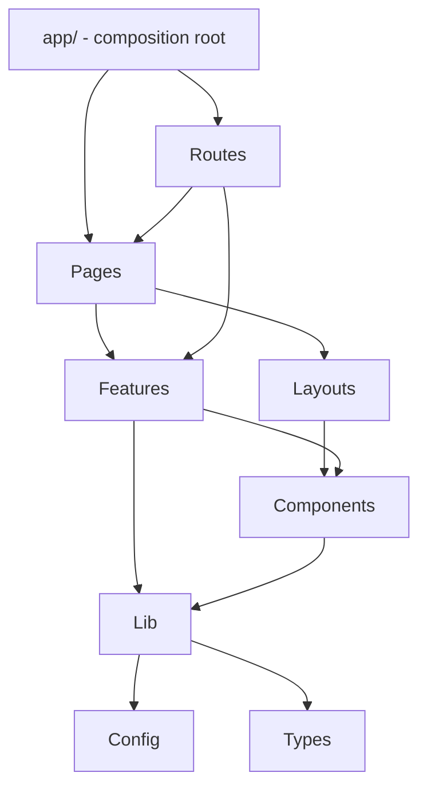

# CustomerSupportCRM — Frontend Architecture

This document describes the architecture of `src/FrontEnd` — a React +
TypeScript SPA built to consume the existing `src/BackEnd` ASP.NET Core API.
**This change contains architecture and infrastructure only.** No CRM business
screens (Customer, Ticket, Agent, User management, ...) are implemented yet.

## 1. Architecture overview

A pragmatic, feature-based React architecture on Vite. Not Onion Architecture
(that's a backend concept) — the frontend's analogous discipline is a single
dependency direction so shared infrastructure never depends on a specific
feature:



- `lib/`, `config/`, `types/`, `utils/` never import from `features/` or
  `pages/` — verified (see §12).
- `components/ui/` (generic, reusable primitives like `LoadingState`) never
  imports from `features/` — genericity is the entire point of that folder.
- `components/layout/` (`Header`, `Sidebar`) is app _chrome_, not a reusable
  primitive, and legitimately depends on `features/auth`'s public `useAuth()`
  hook (e.g. to show a logout button only when authenticated) — this is a
  deliberate, narrow exception to the "components → features" prohibition,
  not a violation of it: `components/ui` stays feature-blind, `components/layout`
  does not need to.
- `features/*` may depend on `components/`, `lib/`, `config/`, `types/` — never
  on another feature (none currently do; nothing to enforce yet, but this is
  the rule going forward).

## 2. Project structure

```
src/FrontEnd/
├── .env.example
├── eslint.config.js
├── .prettierrc.json
├── package.json
├── tsconfig.json / tsconfig.app.json / tsconfig.node.json
├── vite.config.ts
├── docs/frontend-architecture.md
├── public/
│   └── favicon.svg
└── src/
    ├── main.tsx                    — bootstraps React, imports styles/globals.css
    ├── vite-env.d.ts                — types import.meta.env
    ├── app/
    │   ├── App.tsx                  — ErrorBoundary > AppProviders > AppRouter
    │   └── providers/
    │       ├── AppProviders.tsx     — composes every app-wide provider
    │       ├── I18nProvider.tsx     — i18next + document dir/lang sync
    │       ├── ThemeProvider.tsx    — MUI theme + RTL/LTR Emotion cache
    │       └── QueryProvider.tsx    — TanStack Query
    ├── assets/                      — placeholder (README)
    ├── components/
    │   ├── common/ErrorBoundary.tsx
    │   ├── layout/Header.tsx, Sidebar.tsx
    │   └── ui/LoadingState.tsx, ErrorState.tsx, EmptyState.tsx
    ├── config/
    │   ├── env.ts                   — validated VITE_ env access
    │   └── appConfig.ts             — static, non-secret app config
    ├── features/
    │   ├── auth/                    — real infra (see §4)
    │   └── customers/, tickets/, agents/, users/ — README placeholders only
    ├── hooks/useDirection.ts
    ├── layouts/AppLayout.tsx, AuthLayout.tsx
    ├── lib/
    │   ├── api/apiClient.ts, normalizeApiError.ts
    │   ├── auth/tokenStorage.ts, jwt.ts, authEvents.ts
    │   ├── i18n/i18n.ts, resources/{en,ar}/common.json
    │   └── query/queryClient.ts
    ├── pages/HomePage.tsx, LoginPage.tsx, NotFoundPage.tsx
    ├── routes/AppRouter.tsx, ProtectedRoute.tsx, PublicRoute.tsx
    ├── styles/globals.css, theme/{palette,typography,createAppTheme}.ts
    ├── types/api.ts, auth.ts, common.ts
    └── utils/                       — placeholder (README)
```

**Deliberately not created:** `lib/storage/` (a generic localStorage wrapper —
nothing needs one; the one thing that needed centralizing, the access token,
already has its own home in `lib/auth/tokenStorage.ts`) and `app/config/`
(the top-level `config/` already owns all configuration; a second config
folder would just split one concern across two places).

## 3. API communication

`lib/api/apiClient.ts` is the single Axios instance every request goes
through — `baseURL` from `config/env.ts` (`VITE_API_BASE_URL`), a 15s timeout,
JSON headers. Its request interceptor attaches `Authorization: Bearer <token>`
(from `lib/auth/tokenStorage.ts`, only if present) and `Accept-Language:
<current i18n language>` — the same header `src/BackEnd`'s
`RequestLocalizationMiddleware` reads, so backend validation/error messages
come back in whichever language the user has selected on the frontend, with
zero extra plumbing.

No `customersApi.ts`/`ticketsApi.ts`/etc. exist yet — those are added per
feature, once that feature is implemented, importing `apiClient`.

## 4. Error handling & ProblemDetails

`src/BackEnd`'s `GlobalExceptionHandler` returns RFC 7807 `ProblemDetails`
(`status`, `title`, `detail`, `instance`, `traceId`) and, for 400s,
`ValidationProblemDetails` (adds `errors: Record<string, string[]>`) — see
`src/BackEnd/docs/architecture.md`, §12. `types/api.ts` mirrors both shapes
exactly. `lib/api/normalizeApiError.ts` converts _any_ Axios failure —
a ProblemDetails body, a network error, a timeout — into one `ApiError` shape
(`{ status, title, detail?, traceId?, validationErrors? }`) via the response
interceptor, so UI code never branches on Axios/HTTP specifics; it depends on
`ApiError` only. `components/ui/ErrorState.tsx` renders one directly.

## 5. HTTP status handling

Centralized in the response interceptor + `normalizeApiError`, not scattered
per call site:

| Status        | Handling                                                                                                          |
| ------------- | ----------------------------------------------------------------------------------------------------------------- |
| 401           | `apiClient` calls `lib/auth/authEvents.notifyUnauthorized()` — see §6                                             |
| 403           | Surfaces as a normal `ApiError`; a feature renders it (e.g. via `ErrorState`) — no special-cased redirect         |
| 404 / 409     | Surfaces as a normal `ApiError`                                                                                   |
| 400 / 422     | `ApiError.validationErrors` is populated from `ValidationProblemDetails.errors`                                   |
| 5xx / network | `normalizeApiError` produces a generic `ApiError`; `lib/query/queryClient.ts` retries these (not 4xx) up to twice |

The Axios client never imports React Router (see §6) and never redirects on
its own — "Avoid coupling the Axios client directly to React Router" was a
hard requirement, not a suggestion.

## 6. Authentication architecture

**Not implemented:** a login/register API call, password reset, MFA, or user
management — `src/BackEnd` doesn't expose those endpoints yet either. What
_is_ built is everything those will plug into:

- `types/auth.ts` — `JwtClaims`, `AuthUser`, `AuthState`.
- `lib/auth/jwt.ts` — `decodeJwtPayload`/`isTokenExpired`/`rolesFromClaims`.
  Decodes the JWT payload for UI display only (current user's name, roles);
  **never verifies the signature** — that is neither possible nor meaningful
  client-side and remains the backend's job on every request.
- `lib/auth/tokenStorage.ts` — the _only_ place the access token is read or
  written; see §7 for the storage trade-off.
- `lib/auth/authEvents.ts` — a tiny pub/sub so `apiClient`'s 401 handling can
  signal "session lost" without importing React or React Router.
- `features/auth/context/AuthProvider.tsx` + `hooks/useAuth.ts` — the global
  auth _state_. `login(accessToken)` adopts an already-issued token (decodes
  it, stores it, flips `status` to `'authenticated'`) — it does not call any
  API itself, so it doesn't care whether the token came from a password
  login, SSO, or anything else. `logout()` clears everything and is also
  triggered automatically by a 401 via `authEvents`.
- `routes/ProtectedRoute.tsx` / `PublicRoute.tsx` — redirect based on
  `useAuth().status`.

Token expiration is checked via the JWT's `exp` claim (`isTokenExpired`) at
the point a token would be adopted; there is no refresh-token call yet
because the backend doesn't expose one (see §7).

## 7. Token storage (security trade-off, documented deliberately)

The backend issues bearer JWTs (no cookie-based auth is configured — see
`src/BackEnd`'s `Program.cs`), so the frontend must hold the access token
somewhere. `lib/auth/tokenStorage.ts` keeps it in an **in-memory module
variable only** — never in `localStorage`/`sessionStorage`/`document.cookie`.

- **Why:** an in-memory value is invisible to any other script running on the
  page, including an XSS payload — unlike `localStorage`, which any injected
  script can read trivially. That protection is worth more than convenience.
- **Cost:** it does not survive a page reload — the user is signed out on
  refresh until a real session-restoration mechanism exists.
- **Target architecture**, once the backend adds a refresh endpoint: an
  **HttpOnly, Secure, `SameSite=Strict`** refresh cookie set directly by the
  backend (never readable from JavaScript at all) used to silently re-mint an
  in-memory access token after a reload. Falling back to `localStorage` for
  the access token in the meantime was considered and rejected — it would
  reintroduce exactly the XSS exposure this design avoids, for a convenience
  that a short-lived interim state doesn't justify.

**Nothing outside `lib/auth/tokenStorage.ts` touches storage for the token.**
No component/feature reads `localStorage`/`sessionStorage`/`document.cookie`
directly for auth purposes.

## 8. Authorization boundary

`features/auth/authorization.ts` exports `hasRole`/`hasAnyRole` — UX helpers
for decisions like hiding a nav item, nothing more.

**This is documented, not just implied: frontend authorization is never the
security boundary.** Any authenticated user can alter client-side state
(open devtools, edit React state, forge a request) — hiding a button proves
nothing. The only real enforcement is `src/BackEnd`'s
`[Authorize(Roles = ...)]` against `Domain.Constants.Roles` on every
endpoint. Frontend role checks exist purely so the UI doesn't _offer_ actions
the backend would reject anyway.

## 9. Routing

`routes/AppRouter.tsx` — `BrowserRouter` + two route branches:

```
/login   → PublicRoute  → AuthLayout → LoginPage    (redirects to "/" if already authenticated)
/        → ProtectedRoute → AppLayout → HomePage    (redirects to "/login" if not authenticated)
*        → NotFoundPage
```

Both `/` and `/login` are architecture-verification placeholders (per the
task's explicit scope) — real CRM routes are added under the
`ProtectedRoute`/`AppLayout` branch as each feature is implemented, without
changing `ProtectedRoute`/`PublicRoute` themselves. Routing contains no data
fetching and no business logic.

## 10. Localization (English/Arabic)

`lib/i18n/i18n.ts` initializes i18next + `react-i18next`, `en` default,
`fallbackLng: 'en'`, one `"common"` namespace so far
(`lib/i18n/resources/{en,ar}/common.json`). Initialized as a plain module
(not inside a React component) so non-React code — `lib/api/apiClient.ts` —
can read `i18n.language` synchronously for the `Accept-Language` header (§3).
Language persists via `i18next-browser-languagedetector` (`localStorage`,
falling back to the browser's `navigator` language). No user-facing string is
hardcoded in a component; every one goes through `t('namespace.key')`. No
CRM-specific translation keys exist yet — those are added alongside their
feature.

## 11. RTL / LTR

`hooks/useDirection.ts` is the single source of truth: `ar` → `'rtl'`,
everything else → `'ltr'`. Two consumers, both driven by this one hook so
they can never disagree:

- `app/providers/I18nProvider.tsx` sets `document.documentElement.dir`/`lang`
  in a `useEffect` whenever the language changes.
- `app/providers/ThemeProvider.tsx` builds the MUI theme with
  `direction: 'rtl' | 'ltr'` and swaps the Emotion cache between a plain one
  and one running `stylis-plugin-rtl` (MUI's documented RTL approach) — every
  MUI component (including the `Sidebar` drawer's physical `left`/`right`
  positioning) flips automatically; no component contains RTL-specific logic.

### Localization contract for feature stories

Every feature story that adds user-visible UI must follow this contract
(locked in by `platform/multilingual-support-arabic-and-english`):

- New user-visible strings **must** be added as keys in both
  `lib/i18n/resources/en/common.json` and `lib/i18n/resources/ar/common.json`
  (or a new per-feature namespace file alongside the feature). Both language
  files ship in the same commit — a key present in only one language is a bug.
- Components **must** render strings via `useTranslation()` from
  `react-i18next`. No hard-coded English or Arabic prose is allowed in
  `.tsx` files, except the language-switch label itself in
  `common.json → actions.switchLanguage`, which is intentionally written in
  the *other* language (it names the language you'd switch *to*).
- Nothing outside `hooks/useDirection.ts` may compute direction. Anything
  RTL-sensitive must consume `useDirection()` (or MUI's `theme.direction`,
  which `ThemeProvider` derives from the same hook) — never hand-roll
  `direction: rtl` or hard-coded `left`/`right` pixel offsets.
- `lib/api/apiClient.ts` attaches `Accept-Language` from `i18n.language` on
  every request; feature code must route all HTTP calls through `apiClient`
  so this happens automatically, and must never construct a raw `fetch`/
  bare-`axios` call for a feature request.
- Language persists via `localStorage`; the default on first load (no stored
  preference, no matching browser language) is `appConfig.defaultLanguage`
  (`en`). An unsupported stored/detected language clamps to that default —
  i18next's `fallbackLng`, not a code branch, handles this.

## 12. Theme / design system

`styles/theme/`: `palette.ts` (light + dark palettes — dark exists as a
prepared option, not switchable yet; no toggle UI was built for a setting
nothing currently needs), `typography.ts` (one font stack covering both
Arabic and Latin glyphs, so no per-locale font-swapping logic is needed
either), `createAppTheme.ts` (the one place `createTheme()` is called,
parameterized by mode + direction). `ThemeProvider` applies `CssBaseline` for
a consistent baseline. No business screen was styled — this is the
foundation those screens will pull `theme.palette`/`theme.typography` from.

## 13. Forms & validation

`react-hook-form`, `zod`, and `@hookform/resolvers` are installed and ready
(`zodResolver(schema)` is the intended integration point), but **no schema or
form exists yet** — no `CustomerSchema`/`TicketSchema`/login form, per scope.
Validation architecture is compatible with localization the same way the
backend's FluentValidation is: a schema's `.refine`/`message` calls
`i18next.t(...)` rather than a hardcoded string, once real schemas exist.

## 14. TanStack Query

`lib/query/queryClient.ts` — one `QueryClient`, provided by
`app/providers/QueryProvider.tsx`. `staleTime: 30s`, `refetchOnWindowFocus:
false`, and a `retry` function that never retries a 4xx (retrying a 404/401/422
just repeats the same failure) but retries a network/5xx failure up to twice —
reusing `normalizeApiError` so the retry decision is based on the same
`ApiError.status` every other error-handling path uses. No feature query
hooks or query-key structure exist yet — added per feature.

## 15. Global state

No Redux, no global store for future CRM entities. Server state → TanStack
Query. Local UI state → component `useState`. The only two Context providers
are for genuinely global, cross-cutting concerns: `AuthProvider`
(authentication) and the i18next/MUI theme instances (localization/theme) —
exactly the three examples the task named, nothing more.

## 16. Configuration & environment

`config/env.ts` reads `import.meta.env.VITE_API_BASE_URL` and throws a clear,
specific error at startup if it's missing empty — never a vague failure deep
inside an API call. `config/appConfig.ts` holds static, non-secret values
that don't vary per environment (app name, API timeout, supported languages).
`.env.example` documents the one required variable:

```
VITE_API_BASE_URL=https://localhost:7125/api
```

This matches `src/BackEnd/src/CustomerSupportCRM.API/Properties/launchSettings.json`'s
`https` profile (`https://localhost:7125`) plus the `api/[controller]` route
prefix every controller will use (`BaseApiController`). **Only public,
non-secret configuration belongs here** — everything prefixed `VITE_` is
bundled into the browser and readable by anyone; a JWT signing key, database
password, or any backend credential must never be added to a `VITE_`
variable (or to this project at all).

## 17. CORS

CORS is enforced by the backend, not the frontend (`src/BackEnd`'s
`CorsServiceExtensions`, configuration-driven via `Cors:AllowedOrigins`) — the
frontend does nothing to "bypass" it and must not attempt to. For local
development, the backend's `appsettings.Development.json` already allows
`http://localhost:5173` (Vite's default dev port), so no proxy is configured
in `vite.config.ts`; add one only if a specific future dev setup needs it.

## 18. Security boundaries (summary)

- No secret of any kind lives in this project or in a `VITE_` variable (§16).
- The access token lives in memory only, never in `localStorage`/cookies
  readable by JavaScript (§7).
- Frontend role checks are UX only; the backend is the only real
  authorization boundary (§8).
- `dangerouslySetInnerHTML` is not used anywhere in this codebase.
- Logging is `console` only, dev-gated where relevant (`ErrorBoundary`
  logs only when `import.meta.env.DEV`); nothing logs a token, password, or
  credential.

## 19. Accessibility & responsiveness

MUI components carry sensible default ARIA/keyboard behavior; `LoadingState`
sets `role="status"`; `Sidebar` navigation uses semantic `List`/list-item
buttons with real links (`NavLink`) rather than `onClick`-only `div`s, so
keyboard/screen-reader navigation and focus order work without extra code.
Layouts use MUI's flexbox-based `Box`/`Drawer`/`AppBar`, which are
responsive by construction.

### Responsive layout (platform/responsive-web-and-mobile-experience)

- **Breakpoint split**: `md` (MUI default, 900px) is the desktop/mobile line,
  read via `useMediaQuery(theme.breakpoints.up('md'))` in `AppLayout.tsx` -
  no custom breakpoint values are introduced.
- **Drawer variant rule**: `Sidebar` renders MUI's `<Drawer>` as `permanent`
  at `md+` and `temporary` (overlay + backdrop, opened by the `Header`'s
  hamburger `IconButton`) below `md`. `AppLayout` owns the open/close state
  (`mobileOpen`) and passes `variant`/`open`/`onClose` down - `Sidebar` itself
  has no internal open state.
- **Direction handling**: the drawer's `anchor` is derived from
  `useTheme().direction` (`'rtl' ? 'right' : 'left'`), never hard-coded -
  see §11, RTL/LTR. Toggling language flips the anchor automatically because
  `ThemeProvider` rebuilds the theme's `direction` from the same
  `useDirection()` source.
- **Shared constants**: `components/layout/layoutConstants.ts` exports
  `DRAWER_WIDTH`/`HEADER_HEIGHT`, imported by both `AppLayout` and `Sidebar`
  so the drawer width is never duplicated as a magic number.
- **Global overflow guard**: `styles/globals.css` sets
  `overflow-x: hidden` on `html`/`body`/`#root` and caps `img`/`svg`/`video`
  at `max-width: 100%`, so a child component with a fixed/oversized width
  cannot force horizontal scroll on narrow (down to 360px) viewports. This
  is a safety net, not a substitute for fluid CSS in new screens.

## 20. Future feature organization

```
features/<feature>/
    api/         — functions calling lib/api/apiClient
    components/  — feature-specific UI
    hooks/       — TanStack Query hooks, using lib/query's queryClient
    pages/       — route-level composition for this feature
    schemas/     — Zod schemas (react-hook-form + @hookform/resolvers)
    types/       — feature-specific types (not in shared types/)
```

Adding a feature never requires touching `lib/`, `config/`, or another
feature — only `routes/AppRouter.tsx` gains a new `<Route>` under the
`ProtectedRoute` branch, and `components/layout/Sidebar.tsx`'s `navItems`
array gains an entry.

## 21. Prohibited dependencies (enforced)

- `lib/`, `config/`, `types/`, `utils/` must not import from `features/` or `pages/`.
- `components/ui/` must not import from `features/` (components/layout may —
  see §1 for why that's a deliberate, narrow exception, not a contradiction).
- No feature imports another feature.
- `lib/api/apiClient.ts` must not import React Router (verified — see §5).
- Nothing outside `lib/auth/tokenStorage.ts` accesses the token; nothing
  outside `hooks/useDirection.ts` decides RTL/LTR (verified by inspection —
  both are the sole `localStorage`/direction-logic owners in the codebase).

## 22. Validation results

Ran from `src/FrontEnd/`:

- `npm install` — succeeded, 0 vulnerabilities.
- `npx tsc -b` (strict mode: `strict`, `noUncheckedIndexedAccess`,
  `noImplicitOverride`) — **0 errors**.
- `npx eslint .` (flat config: `@eslint/js` + `typescript-eslint` recommended
  - `eslint-plugin-react-hooks` + `eslint-plugin-unused-imports` +
    `eslint-plugin-react-refresh`, Prettier-compatible) — **0 errors, 0 warnings**.
- `npm run build` (`tsc -b && vite build`) — **succeeded**; one advisory (not
  an error) about the main chunk exceeding 500 kB, expected at this stage
  (React + MUI + Emotion + TanStack Query + i18next in one bundle with no
  CRM screens yet to justify route-based code-splitting) — worth revisiting
  once real feature routes exist.
- `npx madge --circular --ts-config tsconfig.app.json src` — **no circular
  dependency found** (44 files traced, alias-resolved).
- Dev server smoke test (`npm run dev`): `GET /` → 200, `GET /src/main.tsx` →
  200 (compiles and serves through Vite's module graph).
- No test framework was installed; none pre-existed in the repository.

## 23. Next step

**Do not implement CRM feature logic as part of this change.**

Recommended first frontend feature once this architecture is approved: the
**login screen** (`features/auth/`, adding `api/`, a Zod schema in
`schemas/`, and a real `LoginPage` using React Hook Form) — wired to the
backend's login endpoint once `src/BackEnd` implements it (see
`src/BackEnd/docs/architecture.md`, "Next step" — user authentication is its
recommended first feature too). It is the natural pairing: this frontend
already has `AuthProvider.login(accessToken)`, `ProtectedRoute`, and
`PublicRoute` waiting for exactly that token, and every other CRM screen sits
behind `ProtectedRoute`.
